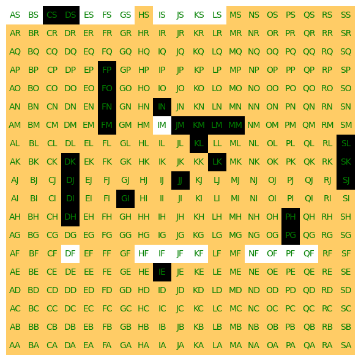

# Motor de juego para Connect6

_Bienvenido al repositorio del proyecto "Connect6 Game Engine". Este motor de juego está diseñado para el juego Connect6. En Connect6, dos jugadores se turnan para colocar sus fichas en un tablero de 19x19, y el objetivo es ser el primero en formar una línea ininterrumpida de seis fichas, ya sea horizontal, vertical o diagonalmente._



## Comenzando 🚀

_Estas instrucciones te permitirán obtener una copia del proyecto en funcionamiento en tu máquina local para propósitos de desarrollo y pruebas._

### Pre-requisitos 📋

_Para comenzar, clona el repositorio en tu máquina local ejecutando los siguientes comandos en tu terminal:_

```
git clone https://github.com/pablorocg/Connect6.git
cd connect6-game-engine
```

### Instalación con Anaconda 🔧

_A continuación, proporcionamos ejemplos paso a paso sobre cómo configurar el entorno de desarrollo y ejecutar el motor de juego utilizando Anaconda._

_1. Instala Anaconda: Si aún no tienes Anaconda instalado, descárgalo desde [anaconda.com](https://www.anaconda.com/products/distribution) e instálalo en tu sistema._

_2. Crea un entorno virtual con Anaconda: Abre una terminal o el Anaconda Navigator y ejecuta el siguiente comando para crear un entorno virtual de Anaconda con Python 3.8 (puedes cambiar la versión de Python según tus necesidades):_

```
conda create --name connect6 python=3.10
```

_3. Activa el entorno virtual: En Windows, ejecuta:_

```
conda activate connect6
```

_En macOS y Linux, ejecuta:_

```
source activate connect6
```

_4. Navega hasta la carpeta del proyecto:_

```
cd ./Connect6/Connect6_original
```

_5. Instala las dependencias del proyecto:_


```
pip install -r requirements.txt
```

_6. Ejecuta el motor de juego:_

```
python main.py
```

_Con estos pasos, el motor de juego Connect6 debería estar funcionando en tu máquina local dentro del entorno virtual de Anaconda._

## Compilación y prueba con GUI 📦

Puedes compilar el proyecto utilizando pyinstaller para crear un ejecutable independiente. Asegúrate de que tienes pyinstaller instalado en tu entorno virtual de Anaconda.

_1. Activa el entorno virtual de Anaconda si no lo has hecho ya:_

```
conda activate connect6
```


_2. Navega hasta la carpeta del proyecto:_

```
cd ./Connect6/Connect6_original
```

_3. Utiliza pyinstaller para compilar el proyecto en un ejecutable:_

```
python pyinstaller --onefile main.py
```

_Esto generará un ejecutable en la carpeta dist dentro de tu proyecto._

_4. Una vez compilado el motor de juego, puedes probarlo en una interfaz gráfica utilizando [Connect6GUI](https://github.com/https://github.com/felixem/Connect6GUI). Sigue las instrucciones en el repositorio de Connect6GUI para ejecutar la interfaz gráfica y jugar al Connect6 con el motor._


## Autores ✒️

* **Mario Amorós Rivera** - [Maristoteles02](https://github.com/Maristoteles02)
* **Pablo Rocamora García** - [pablorocg](https://github.com/pablorocg)
